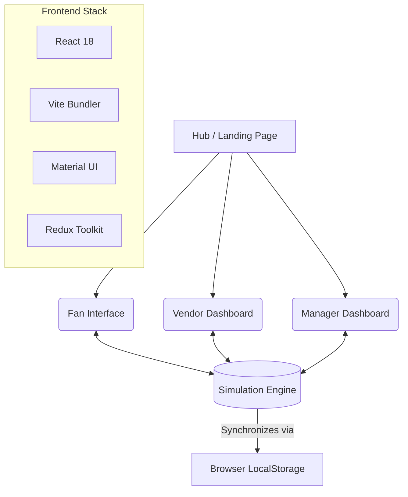

<div align="center">
  <h1>🍕 SnackFlow AI 🏟️</h1>
  <p><strong>Tinder for Stadium Food — Swipe. Skip the Queue. Enjoy the Game.</strong></p>

  [](https://reactjs.org/)
  [](https://vitejs.dev/)
  [](https://www.typescriptlang.org/)
  [](https://redux-toolkit.js.org/)
</div>

<br />

**SnackFlow AI** is a next-generation stadium food ordering system designed to eliminate congestion. Fans swipe to discover food, while AI routes them to the fastest stall. Vendors manage their live queues, and Managers gain a bird's-eye view of stadium demand.

---

## ✨ The Hub & Dashboards

SnackFlow AI is a unified platform comprising three main portals. When accessing the public URL, you'll be greeted by the **Hub Page**, providing instant access to all three experiences.

| Portal | Audience | Path | Description |
|---|---|---|---|
| 🍕 **Fan Interface** | Stadium Attendees | `/fan/` | A mobile-first app where fans swipe right on food they crave, add to cart, and get AI-routed to the optimal stall to minimize walking and queue time. |
| 🧑‍🍳 **Vendor Dashboard** | Food Stall Operators | `/vendor/` | A live dashboard for stall owners to adjust menus, add new items, and monitor their real-time incoming queues. |
| 📊 **Manager Dashboard** | Stadium Operations | `/manager/` | The command center. Displays live stadium heatmaps, predictive AI demand alerts, and comprehensive sales analytics. |

---

## ⚡ Core Features

### 🌪️ The "Swipe" Experience (Fan)
- **Tinder-style Discovery:** A fun, engaging UI. Swipe right to crave, left to pass.
- **Smart Cart Building:** Selected items intelligently build an optimized cart.
- **AI Routing Engine:** Dynamically calculates walking distance + stall prep times + queue length to point fans to the absolute fastest pickup spot.

### 📈 Live Operations (Vendor & Manager)
- **Instant Menu Updates:** Vendors can flag items as "Popular" or "Sold Out," instantly refreshing the Fan's swipe feed across the stadium.
- **Demand Heatmaps:** Managers can view live, color-coded stadium maps showing congestion hotspots in real-time.

### 🤖 **NEW:** Synthetic Forecast Simulator
Since this project is hosted in a serverless environment, we've built a **Browser-based Simulation Engine**. 
- **What it does:** Every 30 seconds, it automatically mutates stall queue lengths, wait times, and rotates "popular" food items.
- **How to see it:** Open the *Manager Dashboard* and *Fan Interface* in separate tabs. Watch the heatmap bubbles change color automatically, and watch the Fan swipe feed instantly promote new trending snacks via browser `localStorage` syncing!

---

## 🏗️ Architecture & Tech Stack

This project is organized as an `npm` workspace monorepo, keeping the frontend apps decoupled yet sharing the same design tokens and types.



### 💻 Technologies
- **UI Framework:** React with Vite
- **Styling:** Material UI (MUI), Emotion, custom CSS
- **State Management:** Redux Toolkit, Context API
- **Data/Sync:** Custom Event dispatchers and `localStorage` (for serverless mock environments)
- **Language:** Fully typed with TypeScript

---

## 🛠️ Local Development

To run the unified SnackFlow AI platform locally:

1. **Install dependencies:**
   ```bash
   npm install --include=dev && npm install --prefix frontend --include=optional
   ```

2. **Run the unified dev environment (All apps):**
   ```bash
   npm run dev:frontend
   ```

3. **Or, build the production unified application:**
   ```bash
   npm run build:unified
   ```

<div align="center">
  <br/>
  <i>Built for the future of stadium experiences. 🚀</i>
</div>
